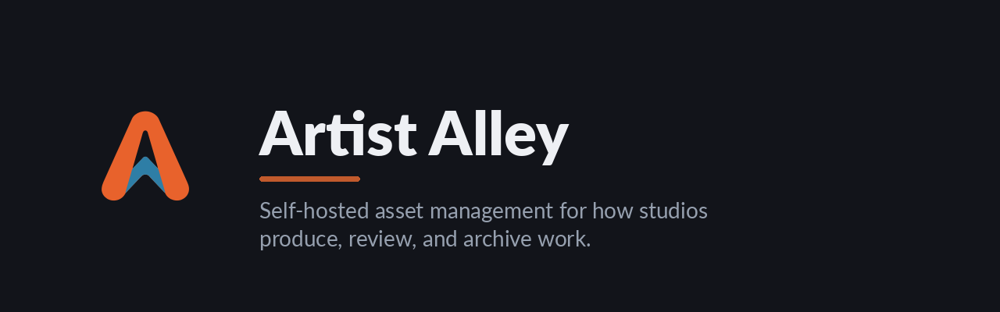

  

  Self-hosted asset management for how studios produce, review, and archive work. 
  One binary, one database, one storage volume — everything from first concept to final delivery, in one place.

  <a href="https://artist-alley.org">Website</a> ·
  <a href="https://artist-alley.org/docs/guides/install">Install</a> ·
  <a href="https://artist-alley.org/docs/guides/getting-started">Docs</a> ·
  <a href="https://github.com/Artist-Alley-Org/artist-alley">Source</a>

---

### What it is

A place to produce and archive, not just store files. Concept, modeling, rigging,
animation, cinematics, finals — in one self-hosted app, instead of spreading the work
across chat, shared drives, and file-transfer links.

The same model fits any team that catalogs things with media attached — museums,
libraries, galleries, archives. Tuned for production work, but general underneath.

### What's in the box

- **One viewer for everything** — images, video, audio, 3D, documents, and more, previewed in the browser and built for review.
- **Find anything fast** — full-text search across every asset, post, tag, and field, plus search by image.
- **Your metadata, your workflow** — custom fields with full history, and review states with an audit trail.
- **Built to federate** — connect two studios and share assets, comments, and approvals directly, with no service in the middle.
- **Reads IIIF** — serves the IIIF standard, so deep-zoom and archive viewers work with your collections.
- **AI when you want it** — image search, transcription, and AI editing you can add on, never forced into the core.

### Small core, optional extras

One binary, one Postgres database, one storage volume — local disk or any S3 bucket.
No message queue or microservices in the core. Heavier features — image similarity,
transcription, Blender thumbnails, AI editing — run as separate containers you add only
if you want them.

### Repositories

| Repo | What it is |
|------|------------|
| [**artist-alley**](https://github.com/Artist-Alley-Org/artist-alley) | The application — Go + Postgres + SvelteKit. Start here. |
| [homebrew-tap](https://github.com/Artist-Alley-Org/homebrew-tap) | Homebrew formulae — `brew install artist-alley-org/tap/…`. |
| [mviewer](https://github.com/Artist-Alley-Org/mviewer) | Rust-native viewer, converter, and glTF exporter for Marmoset `.mview` scenes. |

The remaining repositories are maintained forks of upstream Go libraries the app depends
on (glTF, SVG rasterizing, WebP, thumbhash, EPUB), pinned here for supply-chain safety.

### License

Open source and free to self-host, under **AGPL-3.0-only**. A commercial license is
available if the AGPL doesn't fit your use — see the [website](https://artist-alley.org)
for details.
